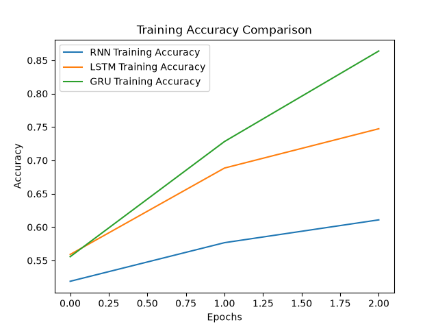
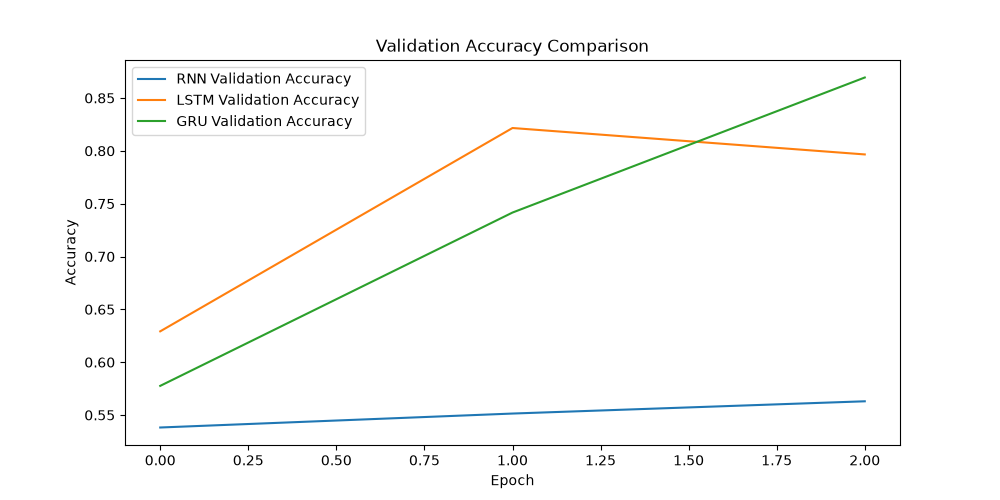
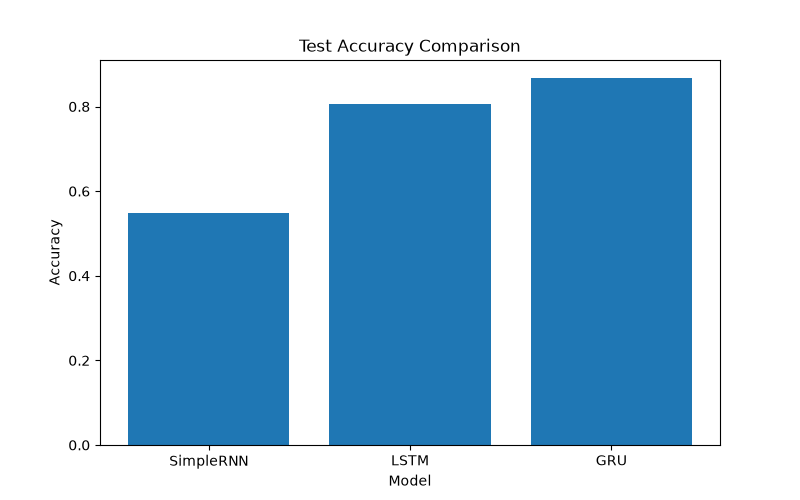
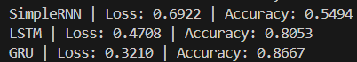

# IMDB Sentiment Analysis: SimpleRNN vs LSTM vs GRU

## Objective
Compare SimpleRNN, LSTM, and GRU architectures for binary sentiment classification on the IMDB movie reviews dataset.

## Dataset
- IMDB Movie Reviews
- Binary classification: Positive / Negative
- Vocabulary size: 10,000
- Maximum sequence length: 200

## Models
All models use:
Embedding → Recurrent Layer → Dense Sigmoid

Compared:
1. SimpleRNN
2. LSTM
3. GRU

## Experimental Setup
- Embedding dimension: 128
- Hidden units: 128
- Batch size: 64
- Epochs: 3
- Optimizer: Adam
- Loss: Binary Crossentropy

## Results
SimpleRNN | Loss: 0.6922 | Accuracy: 0.5494
LSTM | Loss: 0.4708 | Accuracy: 0.8053
GRU | Loss: 0.3210 | Accuracy: 0.8667

## Visualizations
### Training Accuracy Comparison

### Validation Accuracy Comparison

### Test Accuracy Comparison

### Model Comparison

## Key Takeaway
LSTM and GRU are designed to better capture long-term dependencies compared with a basic SimpleRNN, which can suffer from vanishing-gradient issues.
